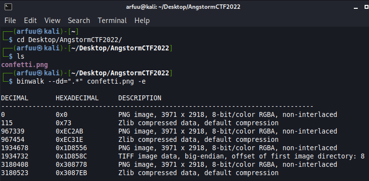

# Challenge Name: Confetti

Given a png file. Assume this must be something to grab the flag in the png image file given. 

## Solution
Use binwalk command to check whether the PNG file given contains any others files. As the result, it contains a lot of others PNG image files and some is compressed in another file as well.  

Use binwalk command to extract it and you will get all the extracted file within the PNG file provided. 
`$ binwalk --dd=".*" confetti.png -e` 

Open the file explorer, and redirect to the folder that has been extracted. It is very obvious that there is a only PNG image file contain something inside. 

Quickly double click to open the 1D8556 image file and you will get the flag. 

## Flag
That's the flag !
`actf{confetti_4_u}`