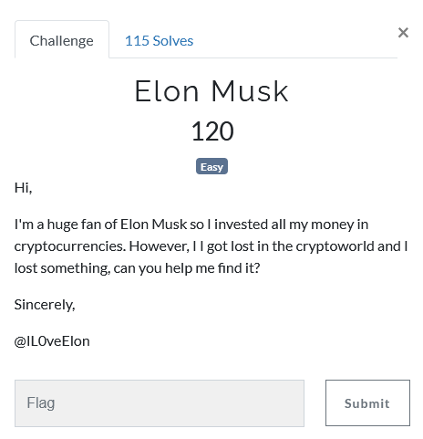
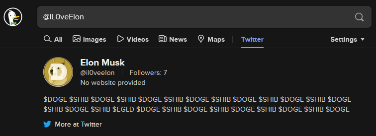
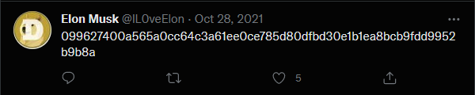
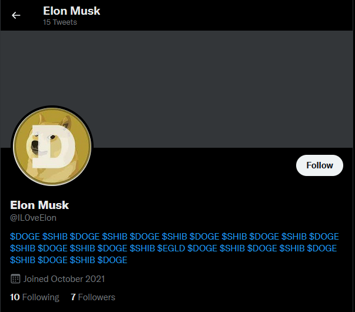
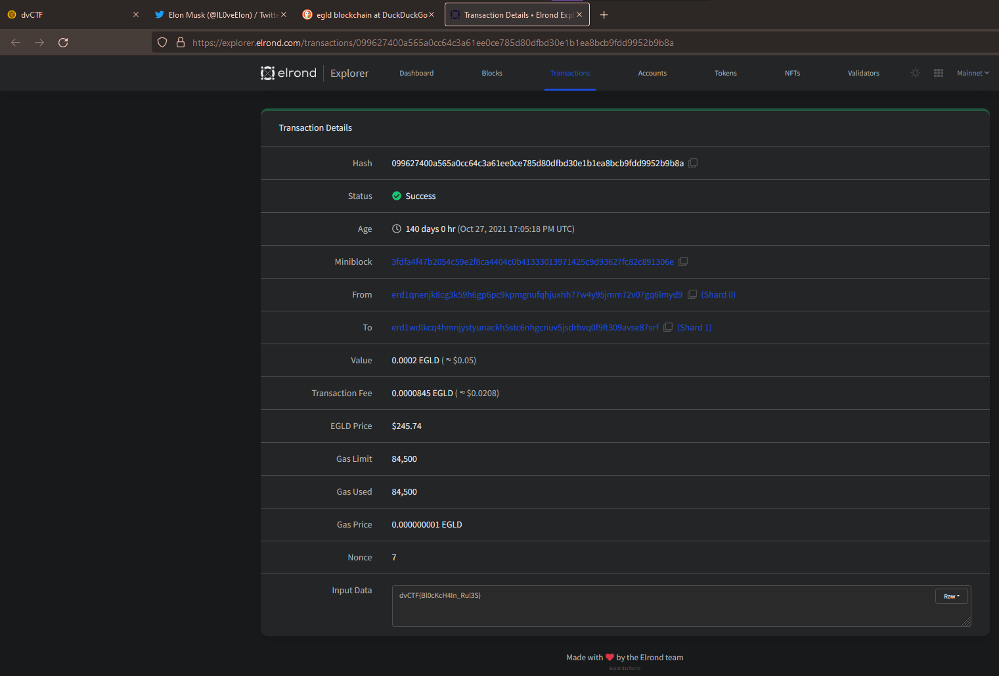

# Challenge Name: Elon Musk
## Question



## Solution
In this challenge, we are given a username `@IL0veElon`. To find out all the related information, I've go through the duckduckgo search engine with the username. I've found out this username is related to 1 of the Twitter account. 



After a thorough search in the twitter account, I've found out one of the tweets which look suspicious that is related to some hash number. 
```
099627400a565a0cc64c3a61ee0ce785d80dfbd30e1b1ea8bcb9fdd9952b9b8a
```



However, I've try most of the hash decoder (md5, sha256, sha512, etc) to try to decode this suspicious number but its still cannot work. I've tried to go through again the Twitter account with the username provided, there are a lot of $ sign which is the hashtag function in Twitter. 

At first, I thought the $DOGE and $SHIB are the key/salt/secret to help to decode the function but obviously I failed it. Then, I look properly again the hashtag again and found out there is one different hashtag, which are $EGLD. This made me remind of the blockchain address as the $EGLD stand as Elrond, which is a cryptocurrency is the market. Even though, I can't solve this question during the CTF because I've no idea where to find out the details of the specific blockchain address. 




After the CTF event, I got the message from one of the member in the CTF discord group said that the blockchain address of EGLD can be find on EGLD blockchain explorer. After pasted the blockchain address provided above, you'll get the flag at the input data section. Now I know that there are a lot of blockchain address finder online provided by the cryptocurrency companies to find out the details of the address. This might help me in order to solve this similar CTF challenge in the future. 

EGLD Blockchain address explorer - https://explorer.elrond.com/



## Flag
That's the flag ! 
```
dvCTF{Bl0cKcH4In_Rul3S}
```