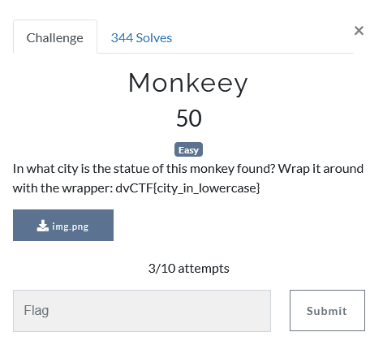
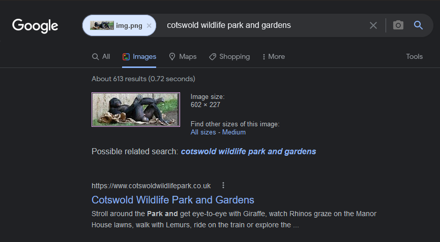
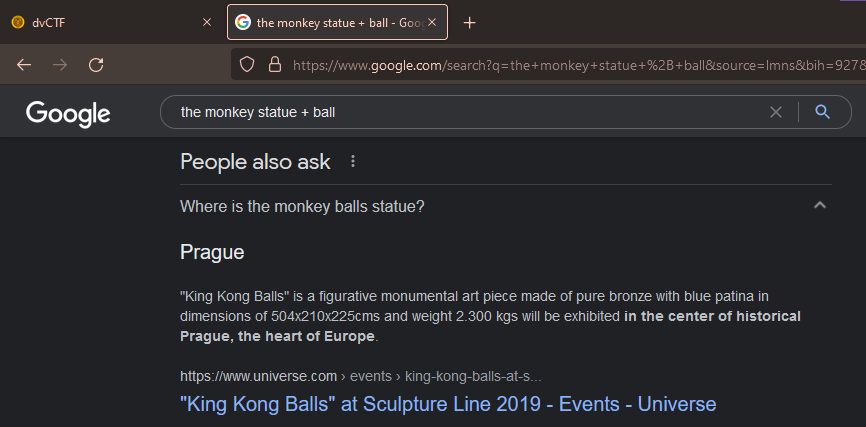

# Challenge Name: Monkeey
## Question


This challenge provided a png image. We are given a hint in the description which the flag format is `dvCTF{city_in_lowercase}`.  


## Solution
Used the google engine to find out the information by uploading the image provided. The google engine has suggested this picture is related to `cotswold wildlife park and gardens`. I've tried to submit the flag as `dvCTF{cotswold_wildlife_park_and_gardens}` but its not the correct flag. 



As the question stated, we need to find out where is the city can be found this monkey statue. I tried to used google search engine and search for `monkey statue + city` and the result still does not give me any clues about it. After a few attempt searching, I finally found the similar image with the question provided. As of the image is some how #nsfw, so I will not posted at here. Then, I found out this statue is exhibited in the center of historical Prague, which is the heart of Europe. 

To submit the flag, using the city Prague and combine with the flag format which is `dvCTF{prague}` and you got the flag for this challenge. 


## Flag
That's the flag !
```
dvCTF{prague}
```