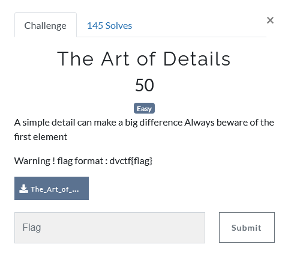
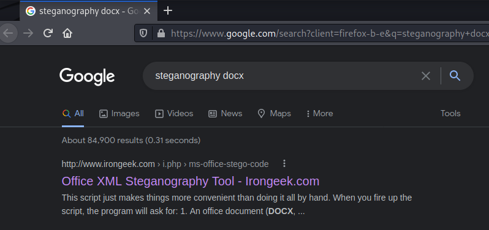
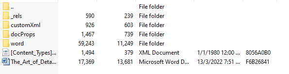
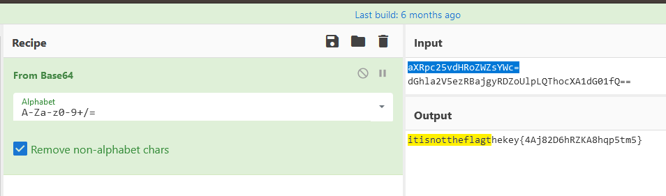
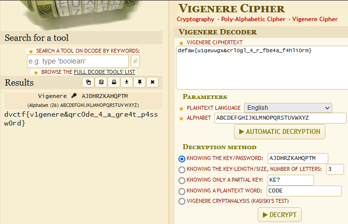

# Challenge Name: The Art of Details

## Question


This challenge has given a word file with the part contents of The Art of War wrote by Sun Tzu. 


## Solution
First of all, I tried to find is that any hidden message hide within the contents. Obviously, I failed it. After that, I noticed this challenge is under the steganography category. Thus, I assumed this challenge must be related with the image/media files. 

Then I used google search engine to find out anything that is related to docx steganography. The reason is because mostly steganography challenges I solve before is given a images. 



After few research, I found out one software that is able to extract all the office xml file of the selected files. 
OfficeXMLFiles: http://www.irongeek.com/i.php?page=security%2Fms-office-stego-code 


By using the software, we will get a zip file after we choose to extract the document provided. There are a lot of folder been extracted. Since it is steganography challenge, I found out three media files in the path `../word/media` and there are three QR codes in the folder. 




Scan three of the QR codes using my phone and I got 3 different strings. 

```
QRCode1 : aXRpc25vdHRoZWZsYWc=
QRCode2 : dGhla2V5ezRBajgyRDZoUlpLQThocXA1dG01fQ==
QRCode3 : defaw{u1qeuugx&crl0gl_4_r_fbe4a_f4hli0rm}
```

According to the format, I guess it is the base64 encoded message. Decoded the message by using the cyberchef and I got the key. 


Based on the key, it need to use the key from QRCode2 (after base64 decoded) to decoded the QRCode3 messages. During the CTF, I am only able to solve the challenge at this step. After the challenge, I found out that it can use the Vigenere online decoder to get the flag. Note, you can't get the flag if you didn't remove the number from the key. 



## Flag
That's the flag ! 
```
dvctf{v1genere&qrc0de_4_a_gre4t_p4ssw0rd}
```