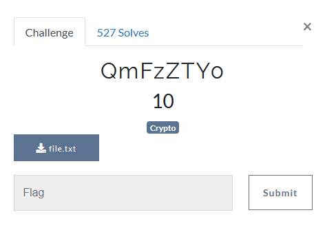
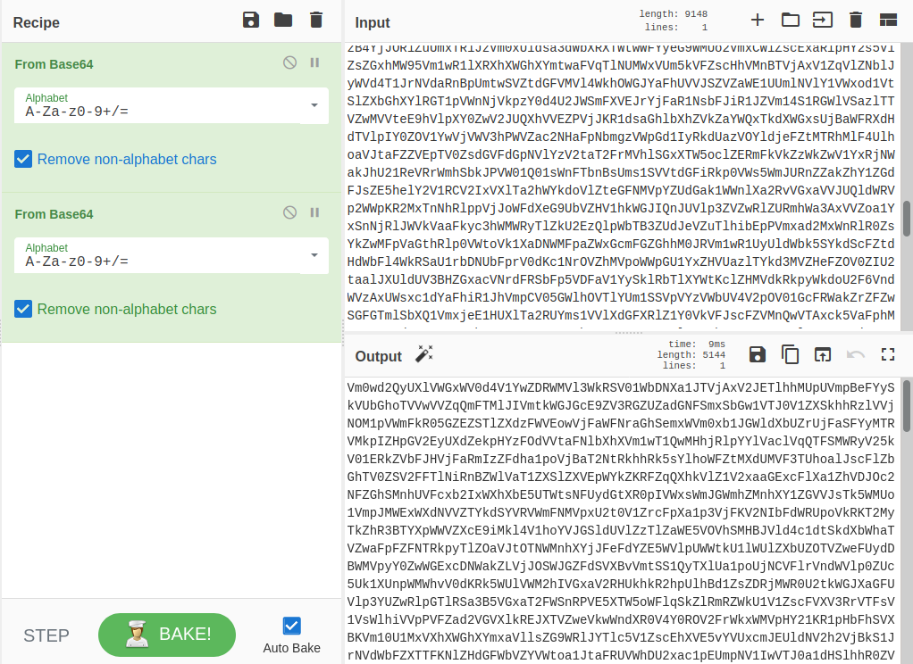
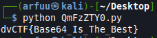

# Challenge Name: QmFzZTY0
## Question


In this challenge we are given a file.txt. Inside the file, there are a lot of strings. According to the challenge title, I assume this is the challenge that is related to base64. I think that the strings in the file.txt is base64 encoded.


## Solution
I am using the cyberchef to decode the message in file.txt 3-5 times and I keep getting the new base64 message. Thus, I think this challenge have to decode the message with base64 iteration. 


In order to solve this question, I've write and use this python script to decode the strings in base64. In this case, I am using the while loop in the script to decode the strings with base64 in iteration way until it found the string with the flag format which is  `dvCTF{`. 
```
#!/usr/bin/env python3
import base64 as b64

flag = ''
with open('file.txt', 'r') as f:
  shouldContinue = True
  candidate = f.read().replace('\n', '').replace(' ', '')
  while shouldContinue:
    candidate = b64.b64decode(candidate)
    if b'dvCTF{' in candidate:
      flag = candidate.decode()
      shouldContinue = False

print(flag)

# Flag: dvCTF{Base64_Is_The_Best}
```

## Running the python script
Run the python script with the command `$ python QmFzZTY0.py` and I get the flag. 



## Flag
That's the flag !
```
dvCTF{Base64_Is_The_Best}
```