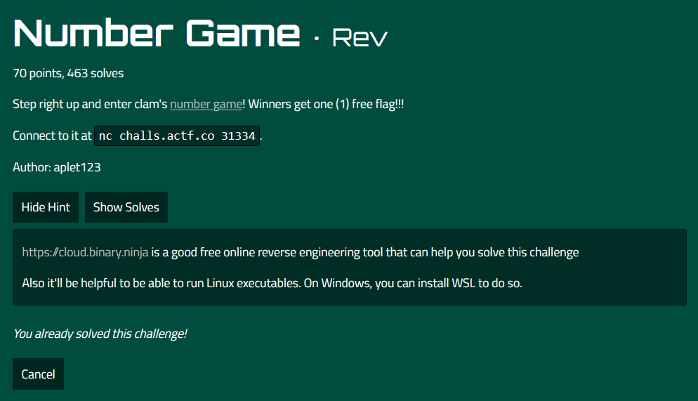
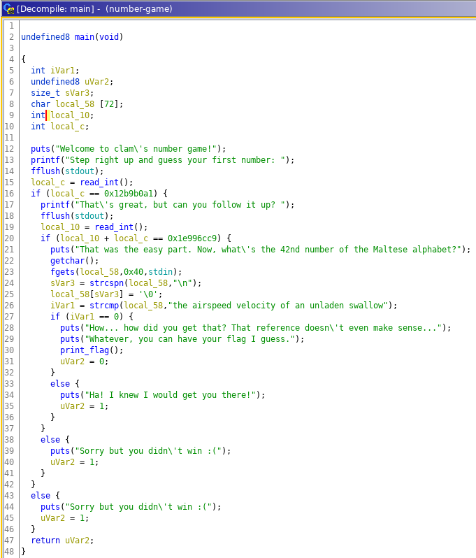
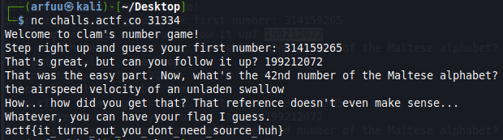

# Challenge Name: Number Game

In this challenge, we are given a netcat command to connect and interact with the server and a source code file. 

## Solution
Open the file in Ghidra and go to the main function, we can see there are some simple if else statement to print out the flag. 

In the first if statement, translate the local_c value from hex to decimal value only can proceed to second if statement. 

In the second if statement, we need to find out the local_10 value. We know that local_10 + local_c = 0x1e996cc9. Use previous local_c value minus 0x1e996cc9 and translate it into decimal and we can proceed to last if statement. 

In the last if statement, simply copy and paste the strings at line 26 which is "the airspeed velocity of an unladen swallow" and we finally we got the flag. 

## Flag
That's the flag !
`actf{it_turns_out_you_dont_need_source_huh}`