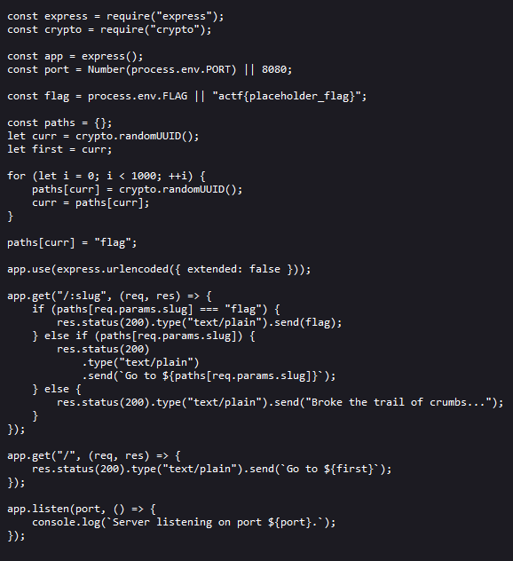

# Challenge Name: Crumbs

Link: https://crumbs.web.actf.co/

Source: index.js https://files.actf.co/07899b85b650719a814695a0b6616e3b78af90d49c012f8f581b2bb699f6f547/index.js

## Solution
Add the path value given at the link provided, it will generate a new path for us. According to the source code, we know that it will generate an amount of 1000 new path for us. We need to keep going to go one by one of the new path generate and the flag is among the 1000 path. 

You can keep copy and paste the new path until you got the flag. 
Alternative, write a python script to auto loop the request and response until it get the flag format "actf". 

## Flag
That's the flag !
`actf{w4ke_up_to_th3_m0on_6bdc10d7c6d5}`