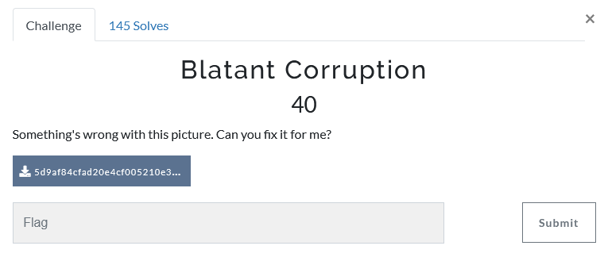
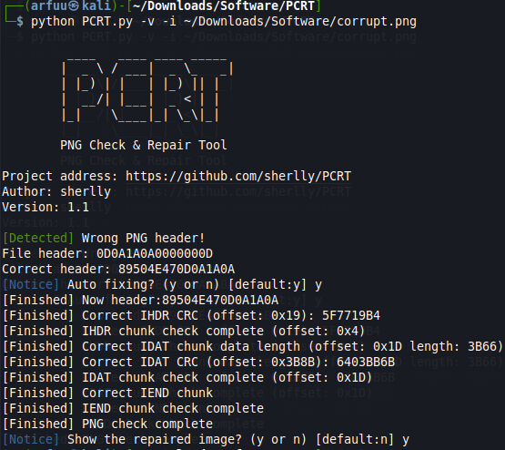

# Challenge Name: Blatant Corruption

## Question


This challenge has given a png file which is unable to open it. According to the challenge title and description, I assume that this is the corrupted png image and we had to fix the corrupted PNG image.


## Solution

According to the PNG signature, the first 8 bytes are as follow
`89  50  4e  47  0d  0a  1a  0a`

Thus, I open the corrupt PNG image in hex editor and found out that the PNG signature which is the first 8 bytes of the file is different from the PNG signature rules as mentioned above.


Thus, I tried to replace the first 8 bytes according to the rules but the files were still corrupted. I think that it is not only the PNG header that is corrupted. For example, IDHR, CRC, IDAT chunk / CRC will also cause the PNG file to be corrupted.

Then, I tried to find that there are a lot of tools I can use to auto fix the PNG corrupt file but it requires payment. Until I found out there is a python source code to solve the PNG corruption files by https://github.com/sherlly/PCRT 

```
Requirement and steps of installation to use the tools
- Python 2.7

Install Python dependency packages
- Tkinter
	$ sudo apt-get install python-tk

- PIL
	$ pip install pillow
```


```
$ git clone https://github.com/sherlly/PCRT 
$ cd PCRT
$ python PCRT.py
```


```
To fix the corrupt PNG file
Run the command:

$ python PCRT.py -v -i corrupt.png
```



You can see that the result above is already fixed the corrupt PNG file. 

Then, in the PCRT directory will found the output.png file. Open the output.png file and you will get the flag.


## Flag
That's the flag !
```
flag{str@ight_n_narr0w}
```

```
References: 
# https://www.w3.org/TR/2003/REC-PNG-20031110/#5PNG-file-signature 
# http://www.libpng.org/pub/png/spec/1.2/PNG-Rationale.html#R.PNG-file-signature 
```
