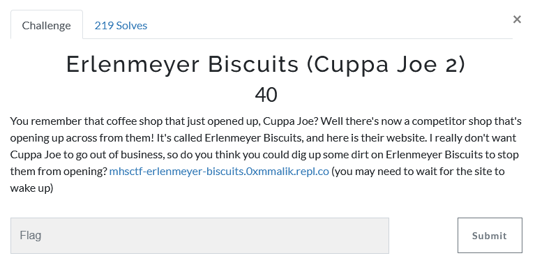
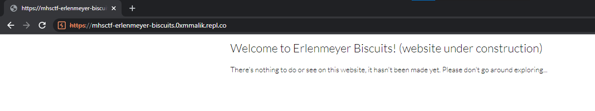
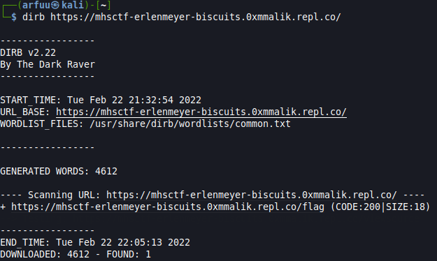
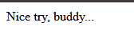
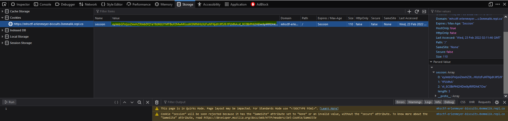
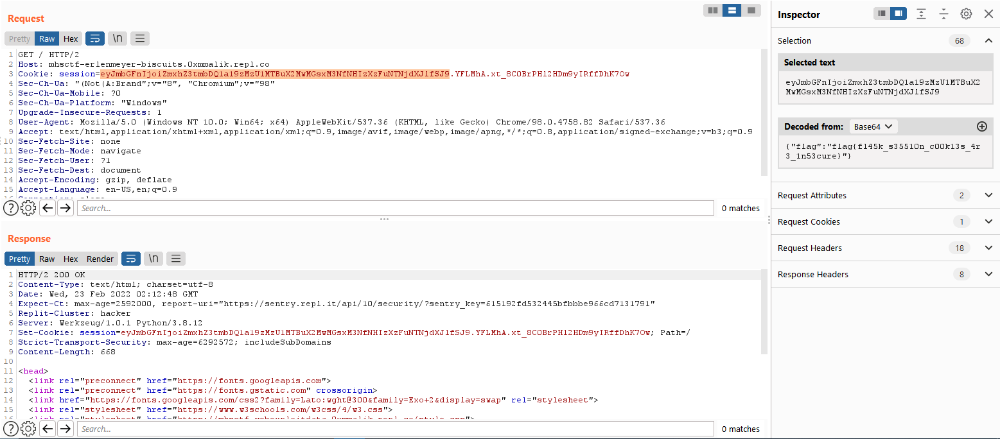

# Challenge Name: Erlenmeyer Biscuits (Cuppa Joe 2) (40p)
## Question



## Solution
Open the link will give us into this page. 



Tried to bruteforce the possible directory with the dirb wordlist with the command:
```
dirb https://mhsctf-erlenmeyer-biscuits.0xmmalik.repl.co/
```

Then you will get the result.


Open the link found by dirb bruteforce, which https://mhsctf-erlenmeyer-biscuits.0xmmalik.repl.co/flag 
It only showed this msg. 



After that, check for the cookies of the website, found out the value is very sus. 



Put inside burpsuite and highlighted the cookies values and get the flag which is decoded from base64 


That's the flag!
```
flag{fl45k_s35510n_c00k13s_4r3_1n53cure}
```
