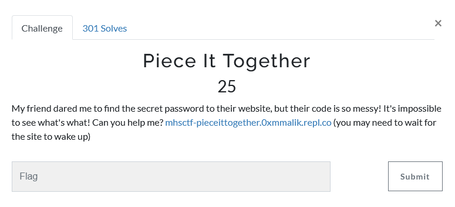
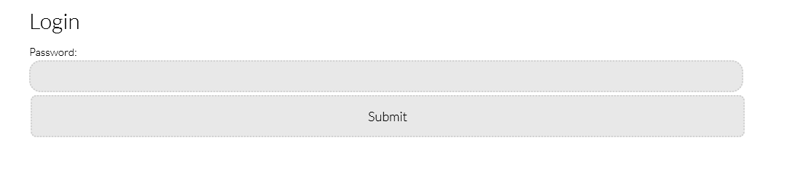
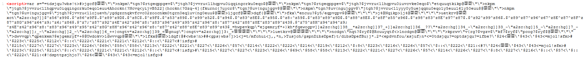
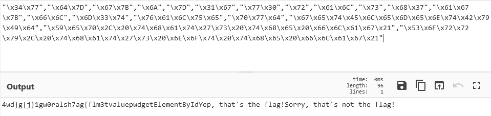
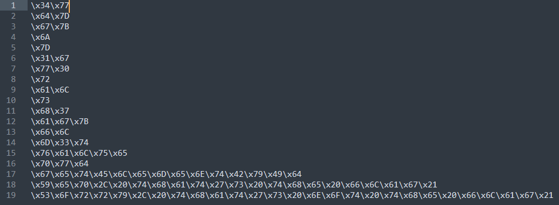
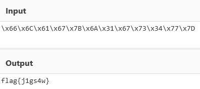
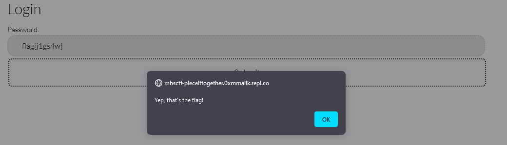

# Challenge Name : Piece It Together (25p)

## Question



## Solution
Open the link will get us into this page. We'll need to get the correct password only can get the flag. 


First of all, look at the page source codes to find the script of to verify password.
As below, the source codes is obfuscates. 


However, press F12 in the website to inspect the elements. You will see the script written in hex which is used to verify the password. 
```
<script>
var _0xa8fe=["\x34\x77","\x64\x7D","\x67\x7B","\x6A","\x7D","\x31\x67","\x77\x30","\x72","\x61\x6C","\x73","\x68\x37","\x61\x67\x7B","\x66\x6C","\x6D\x33\x74","\x76\x61\x6C\x75\x65","\x70\x77\x64","\x67\x65\x74\x45\x6C\x65\x6D\x65\x6E\x74\x42\x79\x49\x64","\x59\x65\x70\x2C\x20\x74\x68\x61\x74\x27\x73\x20\x74\x68\x65\x20\x66\x6C\x61\x67\x21","\x53\x6F\x72\x72\x79\x2C\x20\x74\x68\x61\x74\x27\x73\x20\x6E\x6F\x74\x20\x74\x68\x65\x20\x66\x6C\x61\x67\x21"];function checkpwd(){if(document[_0xa8fe[16]](_0xa8fe[15])[_0xa8fe[14]]== (_0xa8fe[12]+ _0xa8fe[11]+ _0xa8fe[3]+ _0xa8fe[5]+ _0xa8fe[9]+ _0xa8fe[0]+ _0xa8fe[4])){alert(_0xa8fe[17])}else {alert(_0xa8fe[18])}}
</script>
```

We found out that the script is written in hex. Convert it in CyberChef https://gchq.github.io/CyberChef/ 



If the password is in position ```(_0xa8fe[12]+ _0xa8fe[11]+ _0xa8fe[3]+ _0xa8fe[5]+ _0xa8fe[9]+ _0xa8fe[0]+ _0xa8fe[4]))```, then it is correct. 

We arrange the hex into a sequence as below, 



Then combine and convert it into hex according the sequence required

```
\x66\x6C\x61\x67\x7B\x6A\x31\x67\x73\x34\x77\x7D
```


Verify password through the website and we got it !



That's the flag!
```
flag{j1gs4w}
```