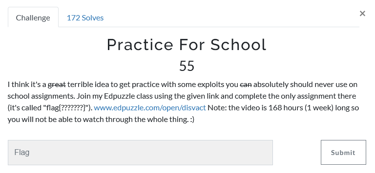
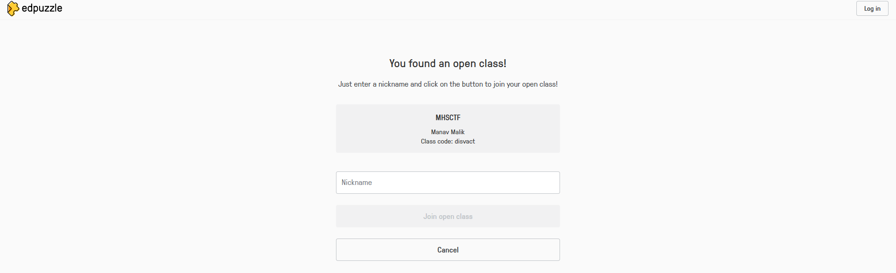
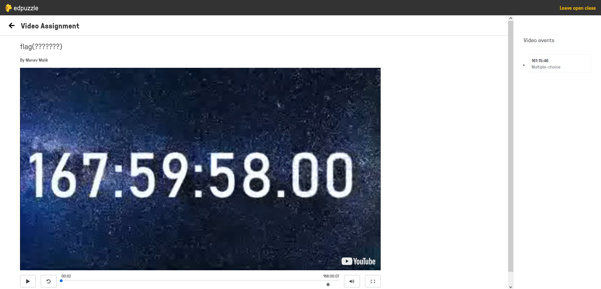
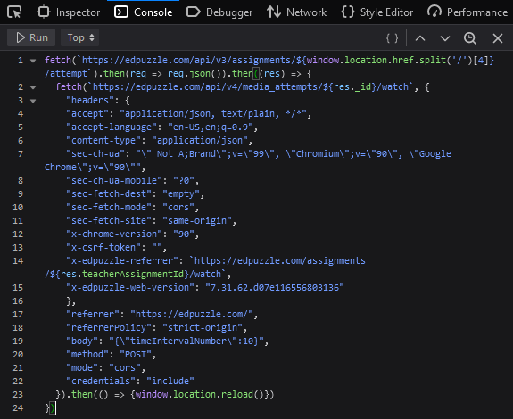
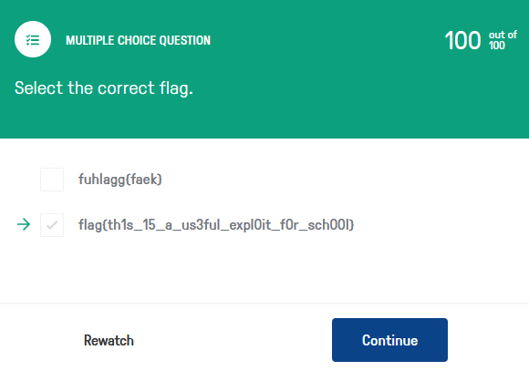

# Challenge Name: Practice For School (55p)

## Question


Given a link of Edpuzzle class code, we need to join the class and watch the video to get the flag. 



The video given is 160+ hours, which is along one week long. The video is lock by the author and it is unable to move fast forwards. I've keep pressing right arrow key to move fast forward, but it only can fast forward for 1-2 sec. 



After google a lot of method to fast forward the lock video in Edpuzzle, I found out the source code which is the script to allow us bypass the website. 
```
//Ref: https://www.youtube.com/watch?v=5ljL7ZjjQKM&ab_channel=EastArctica 

fetch(`https://edpuzzle.com/api/v3/assignments/${window.location.href.split('/')[4]}/attempt`).then(req => req.json()).then((res) => {
	fetch(`https://edpuzzle.com/api/v4/media_attempts/${res._id}/watch`, {
	  "headers": {
		"accept": "application/json, text/plain, */*",
		"accept-language": "en-US,en;q=0.9",
		"content-type": "application/json",
		"sec-ch-ua": "\" Not A;Brand\";v=\"99\", \"Chromium\";v=\"90\", \"Google Chrome\";v=\"90\"",
		"sec-ch-ua-mobile": "?0",
		"sec-fetch-dest": "empty",
		"sec-fetch-mode": "cors",
		"sec-fetch-site": "same-origin",
		"x-chrome-version": "90",
		"x-csrf-token": "",
		"x-edpuzzle-referrer": `https://edpuzzle.com/assignments/${res.teacherAssignmentId}/watch`,
		"x-edpuzzle-web-version": "7.31.62.d07e116556803136"
	  },
	  "referrer": "https://edpuzzle.com/",
	  "referrerPolicy": "strict-origin",
	  "body": "{\"timeIntervalNumber\":10}",
	  "method": "POST",
	  "mode": "cors",
	  "credentials": "include"
	}).then(() => {window.location.reload()})
})
```


Press F12 in the website, then paste and run the code in the console tab. Then you will able to move fast forward the video to get the question. 



Select the correct answer and you get the flag.




```
flag{th1s_15_a_us3ful_expl0it_f0r_sch00l}
```