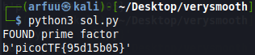

# Challenge Name: Very Smooth
## Question


In this question, we're provided two files and 1 hints. 

Files gen.py: 
```
#!/usr/bin/python

from binascii import hexlify
from gmpy2 import *
import math
import os
import sys

if sys.version_info < (3, 9):
    math.gcd = gcd
    math.lcm = lcm

_DEBUG = False

FLAG  = open('flag.txt').read().strip()
FLAG  = mpz(hexlify(FLAG.encode()), 16)
SEED  = mpz(hexlify(os.urandom(32)).decode(), 16)
STATE = random_state(SEED)

def get_prime(state, bits):
    return next_prime(mpz_urandomb(state, bits) | (1 << (bits - 1)))

def get_smooth_prime(state, bits, smoothness=16):
    p = mpz(2)
    p_factors = [p]
    while p.bit_length() < bits - 2 * smoothness:
        factor = get_prime(state, smoothness)
        p_factors.append(factor)
        p *= factor

    bitcnt = (bits - p.bit_length()) // 2

    while True:
        prime1 = get_prime(state, bitcnt)
        prime2 = get_prime(state, bitcnt)
        tmpp = p * prime1 * prime2
        if tmpp.bit_length() < bits:
            bitcnt += 1
            continue
        if tmpp.bit_length() > bits:
            bitcnt -= 1
            continue
        if is_prime(tmpp + 1):
            p_factors.append(prime1)
            p_factors.append(prime2)
            p = tmpp + 1
            break

    p_factors.sort()

    return (p, p_factors)

e = 0x10001

while True:
    p, p_factors = get_smooth_prime(STATE, 1024, 16)
    if len(p_factors) != len(set(p_factors)):
        continue
    # Smoothness should be different or some might encounter issues.
    q, q_factors = get_smooth_prime(STATE, 1024, 17)
    if len(q_factors) != len(set(q_factors)):
        continue
    factors = p_factors + q_factors
    if e not in factors:
        break

if _DEBUG:
    import sys
    sys.stderr.write(f'p = {p.digits(16)}\n\n')
    sys.stderr.write(f'p_factors = [\n')
    for factor in p_factors:
        sys.stderr.write(f'    {factor.digits(16)},\n')
    sys.stderr.write(f']\n\n')

    sys.stderr.write(f'q = {q.digits(16)}\n\n')
    sys.stderr.write(f'q_factors = [\n')
    for factor in q_factors:
        sys.stderr.write(f'    {factor.digits(16)},\n')
    sys.stderr.write(f']\n\n')

n = p * q

m = math.lcm(p - 1, q - 1)
d = pow(e, -1, m)

c = pow(FLAG, e, n)

print(f'n = {n.digits(16)}')
print(f'c = {c.digits(16)}')

```


File output.txt
```
n = 78428327ba89ad5746fd5546b9cab148c9ee3b634eb4b6da6256e56782c6b3fdfddee19cc4a07c1b97c5f5148108f11c29e5ebfbdd8a48247cb64fc39cba6148d2c55ff85762d64e61fdfb57b66c21d2380b4362b5fee96b0553daebec02aa4832c755a3c5e61fb9f18b9504401a1021c7dffbd8896cbf592a2d68692bd15aa141af385b396185ba6582e8e9feacf2f3977a6a8dcdb6835e4807604afea9f1e6063787f6b1bd33f724f11a5834d38f4eebe3019a06adb5011de6e289d18eb020d21d0d97e35be47ff3605bbbb4a6c481a5d01c2383712360a8f3bc63ca63013d3ea2c19dd78eb475d2ff231b4ecccd17b5e81ecdfad9ca4a704c4bf1d53211e9
c = 310a423b12a26d0c8244181d158571f973c42e9ebae9ae004aabd371568efaa199e4d163e6698ab3c372d80ceb97eb793ef5183eb931abe57fbdaae2fcf1e195ac16cdf1fe73fcecc35c931edee66f7a7a4c228a8f7edb1fa8902be03e95bf507e5a9ae43e87782da46655ff2a7efd192989e59348d4b520bd6d2485997d0b0f069449b231cd073c89ff792e18b7ca34a6cf6d18ffb7e43d2e0a5eb690f34fd8acb56dc986eb8bf524b311f331f25ecaea4f36cd71bda0f177bcfc27b121a871c126956928dca21528a57af8749b9bb92759dea2d054d434f3fe38178a20e3b1ed75d6afb60e83b15e9193594b4d5ad300bb40754c6886d79ccd0689353a2edd

```

## Solution
Based on the challenge tag, this challenge is belong to RSA challenge. In the gen.py and output.txt file, we are given values of n, c and e. I've tried to find out the value p and q by factories the n using the online tools (factordb.com), but the n values cannot be factories. 

`Hint: Don't look at me... Go ask Mr. Pollard if you need a hint!`

According to the hints given, this challenge required to use the method of Mr. Pollard to solve this RSA challenge. I tried to research on Google with the keyword `RSA + Mr. Pollard` and I found out that there is a techniques known as Pollard's p - 1 method. We can used the Pollard's p - 1 algorithm to factories the n value. 

To find out more about Pollard's algorithm, please refer to this link: 
https://montoguequiz.com/electrical/rsa-public-key-pollard-algorithm/

There are the step of Pollard's p - 1 factorization algorithm I got from the link provided above. 


After understand the logic and the steps of Pollard's p - 1 factorization algorithm, we can write a python script to factories the n value with the Pollard's p - 1 factorization algorithm. 

First of all, convert the value n and value c from hex to decimal. Then, write a function with the Pollard's p - 1 factorization algorithm to factories the value n. After factories the value n with the Pollard's algorithm, we can solve this challenge as usual RSA challenge. 

To solve this challenge, run this python script below and I am able get the flag of this challenge. 

```
from Crypto.Util.number import *

n = 15181395045780414655903964390469540970376924833330510230254573052861216881146977662114336420620958061376174259242634273513049275570365115246311876385799366523143417585661433999403446827315275343047507463972645674294450653784799398283826023015151509074525470121237663954850175356445826371894553681478812679783459047003026013729106366401689186439617140583526663464690999012733939717678739802931212262804572081233104831659683817111568449928015177950058431556251053649394183072593924059616459232381999041942634225567927748601272223850977603117008456356686238824891905322140674223965362682114660659622593517181923371389417 

c = 6190735703693314139201958212641495802751253350573325964695044176833142422971352791363540577632595643560365776527705792100748635432893076420294363290962675473378649243104140900480084085540008174497719979318326543097860613841984842959169933640926268061249200396400003015987872699410439343571554795376590888003337174589139426908554685004272865597757964095011850074560774700714476809224001787230430051976873949902526360927800174636152911443163088786049917873894970734209620145828045481699472070234973060210909531600983216423040572020352125054898366959668300561468630549515853830743333491229405770177357906376978568195805

e=65537


#Pollard's p-1 factorization algorithm
def factories(n):
    a = 2
    b = 2
    while True:
        if b % 10000 == 0:
            pass
            
        a = pow(a, b, n)
            
        p = GCD(a - 1, n)
        if 1 < p < n:
            print("FOUND prime factor")
            return p
            
        b += 1


p=factories(n)
q=n//p
phi=(p-1)*(q-1)
d=inverse(e,phi)
m=pow(c,d,n)
print(long_to_bytes(m))
```


I've also found out the previous similar CTF writeup from Angmar's Website. May refer to this link: https://angmar2722.github.io/CTFwriteups/2021/buckeye2021/#super-vdf


## Flag
That's the flag !



`picoCTF{95d15b05}`
