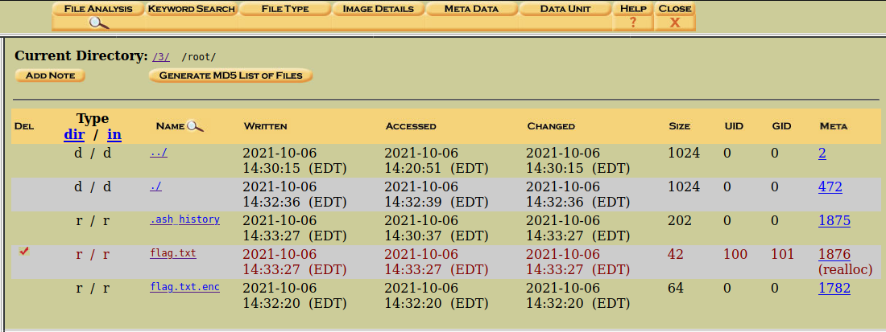
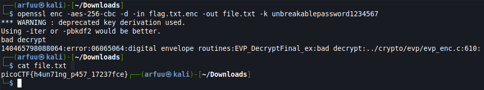

# Challenge Name: Operation Orchid
## Question


In this challenge, we're provided a disk image compressed in extension .gz. We need to find out the flag within the disk image file. 


## Solution
To solve this challenge, unzip the file with the command `gzip -d disk.flag.img.gz` and you will get a disk.flag.img file. To solve this question, I am using the same step as the challenge Sleuthkit Apprentice which is using the AutoSpy to figure out all the files within the disk.flag.img file. 

In this case, the flag path is stored same as the previous challenge, which is `/3/root/flag.txt`. However, select the flag.txt file won't give you the flag. 




Then, I check for flag.txt.enc and got the salted value. This file is the encoded file of the flag.txt. 


Check for the .ash_history file as well. Based on the file name, I assume this is the history step of how the author trying encrypt the flag.txt. I saw there is using the openssl with the salt and a password to encrypt the flag.txt, `unbreakablepassword1234567`. 


After that, I went to research on how to decrypt the file using openssl command with the password. Basically, openssl is a program and library that support many types of cryptographic operations. 

To decrypt the flag.txt.enc, download the file from AutoSpy. Then use the following command to decrypt it with the password we got in the .ash_history and output it into the file.txt. Then, display the file.txt content with the cat command and I got the flag. 

```
$ openssl enc -aes-256-cbc -d -in flag.txt.enc -out file.txt -k unbreakablepassword1234567 

$ cat flag.txt

```




## Flag
That's the flag !
`
picoCTF{h4un71ng_p457_17237fce}
`


Reference- https://www.shellhacks.com/encrypt-decrypt-file-password-openssl/
