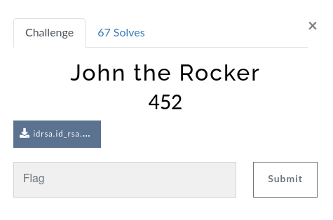
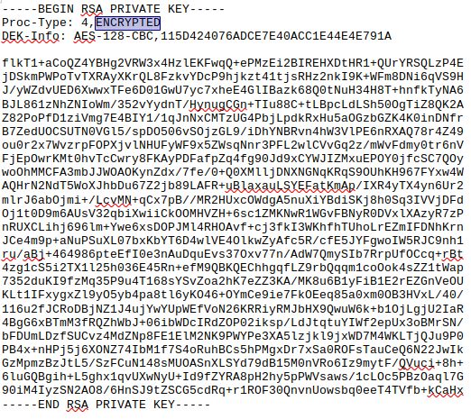
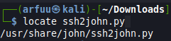

# Challenge Name: John the Rocker
## Question


In this challenge, we're provided a docx file. Open the docx file with a word software, a RSA private key is given inside the docx file. According to the info given in the docx file, there is a message/password/information has been encrypted. I assume that we need to decrypt by using this private key. 




## Solution
First of all, I go and search the keyword `id_rsa decrypt with John` in Google as the title was given `John` and the file name was `id_rsa`. Then, the result gave me the clue that we need to solve this challenge by using the John the Ripper. 

John the Ripper is a password cracker that is open source of password security auditing and password recovery tool. It is available for a lot of operating system as well as the Kali Linux OS which already built in. 

In this case, I am using the python script ssh2john.py to crack the password. To locate and find out the python script, used the command `$ locate ssh2john.py`. 

If the script is not in your machine, you can get the script by using the command 
`$ wget https://github.com/openwall/john/blob/bleeding-jumbo/run/ssh2john.py` 




After that, convert the private key we get from the challenge into a hash. Then the hash will need to use to crack by the John the Ripper password cracking tool with the script `ssh2john.py` we downloaded above. 

Run the command to convert it into the hash -  
`$ python ssh2john.py idrsa.id_rsa.docx > idrsa.hash`


After that, you may need a wordlist to brute force the password to crack for the hash file. In this case, I'm using the rockyou.txt as my wordlist. 

Type the command to bruteforce and crack the password hash-
```
$ sudo john idrsa.hash -wordlist=/arfuu/rockyou.txt


## To display the result, use --show command:
$ john --show idrsa.hash
```


Even though it doesn't clearly stated the password hash decrypted is the flag, but I just try to submit is with the flag format and I got it correct. 

## Flag
That's the flag !
`
vishwactf{!!**john**!!}
`